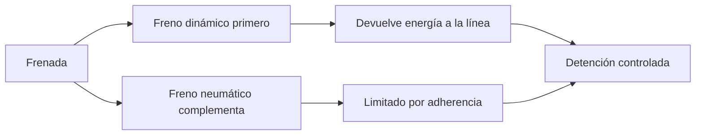

<!-- clase-meta
tipo_documento: clase
clase: 10
codigo: TRENPASAJERO-10
curso: tren-pasajeros
titulo: "Recursos del tren de pasajeros"
modalidad: "taller documental"
duracion_minutos: 45
nivel: introductorio
prerrequisito: TRENPASAJERO-09
competencia: "alfabetizacion_tecnica"
resultados_aprendizaje:
  - "Explicar glosario, esquemas y trazabilidad de fuentes con vocabulario propio de Tren de pasajeros."
  - "Aplicar esos conceptos a una decisión segura o a un escenario de simulación de Tren de pasajeros."
evidencia: "Glosario aplicado y ficha breve de trazabilidad."
criterio_aprobacion: "Los términos permiten interpretar el curso y las fuentes se distinguen por autoridad, alcance y vigencia."
fuentes: manuales/fuentes.md
ultima_revision: 2026-09-10
-->

# 🧰 Recursos del tren de pasajeros

[🏠 Inicio](../../../README.md) · [🚆 Curso: Tren de pasajeros](../README.md) · 🧰 Recursos

Glosario específico, enlaces y diagramas de apoyo del curso de tren de pasajeros.
Amplia el [glosario general](../../../docs/05-glosario-general.md).

---

## 📖 Glosario específico

| Término | Definición |
| --- | --- |
| Pantógrafo | Brazo articulado sobre el techo que capta corriente de la catenaria. |
| Catenaria | Cable aéreo bajo tensión que alimenta el tren eléctrico. |
| Bogie | Carro de ejes bajo el vehículo que gira para tomar las curvas. |
| Pestaña | Reborde de la rueda que la guía sobre el riel y evita el descarrilamiento. |
| Adherencia rueda-riel | Agarre disponible del contacto acero-acero antes de patinar. |
| Freno dinámico | Frenado que usa los motores de tracción como generadores. |
| Freno regenerativo | Freno dinámico que devuelve energía a la catenaria. |
| ATP | Sistema que protege la velocidad y frena si se excede el límite. |
| Trocha | Distancia entre las caras internas de los dos rieles. |

---

## 🗺️ Diagrama de reparto de frenado

```mermaid
flowchart LR
    Frenada[Frenada] --> Dinamico[Freno dinámico primero]
    Dinamico --> Regenera[Devuelve energía a la línea]
    Frenada --> Neumatico[Freno neumático complementa]
    Neumatico --> Adherencia[Limitado por adherencia]
    Regenera --> Parada[Detención controlada]
    Adherencia --> Parada
```

---

## 🔗 Enlaces y fuentes

- Marco legal: [⚖️ docs/07-marco-legal-chile.md](../../../docs/07-marco-legal-chile.md)
- Registro de fuentes: [📚 manuales/fuentes.md](../../../manuales/fuentes.md)
- Fuente institucional del operador estatal (EFE): ver el registro de fuentes.

Registrar cada recurso nuevo con su origen y licencia, siguiendo
[`recursos/README.md`](../../../recursos/README.md).

## 🧭 Guía de estudio aplicada

### Pregunta guía

¿Cómo ayuda **Glosario específico, Diagrama de reparto de frenado, Enlaces y fuentes y Guía de estudio aplicada** a **explicar con fuentes los términos captación o motor, convertidor de tracción, motores de eje y rueda-carril**?

### Explicación razonada

El vocabulario técnico organiza relaciones: captación o motor, convertidor de tracción, motores de eje y rueda-carril nombran partes distintas de una misma cadena funcional. Una fuente se usa para sostener una afirmación concreta —principio, límite, procedimiento o contexto— y debe distinguirse del manual particular de un fabricante o de una regla narrativa.

Esta clase se conecta con el resto del curso mediante **adherencia rueda-carril, curva de frenado y cumplimiento de señales**. El hilo de
seguridad consiste en reconocer a tiempo **rebasar el punto de parada o comprometer la comodidad por frenar tarde** y poder justificar la decisión
**anticipar la frenada según señal, pendiente, adherencia y carga**; en clases posteriores cambiará el ángulo de análisis, no esa relación causal.
La lectura funcional común sigue **captación o motor → convertidor de tracción → motores de eje → rueda-carril**, de modo que cada concepto pueda
ubicarse dentro del funcionamiento completo y no quede como un dato aislado.

**Apoyo documental:** [Railroad Operating Practices](https://railroads.fra.dot.gov/railroad-safety/divisions/operating-practices/operating-practices-0) aporta operación, señalización y competencias ferroviarias;
[Human Factors: Tasks and Demands](https://railroads.fra.dot.gov/human-factors/elearning-attention/tasks-demands) se usa para factores humanos y carga de trabajo. Estas fuentes
se contrastan con el alcance de la clase y no sustituyen un manual de equipo concreto.

### Caso resuelto: de la observación a la decisión

1. **Definir en contexto:** explica **captación o motor**, **convertidor de tracción**, **motores de eje** y **rueda-carril** por su función y relación.
2. **Respaldar:** enlaza cada afirmación importante con una fuente identificable y declara su alcance.
3. **Contrastar:** separa principios generales, requisitos locales, manual de fabricante y —si aplica— canon ficticio.
4. **Reformular:** convierte una definición copiada en una explicación propia con un ejemplo de **Tren de pasajeros**.

### Comprueba tu comprensión

1. Explica la diferencia funcional entre **convertidor de tracción** y **motores de eje** sin copiar una definición.
2. ¿Qué fuente respalda el principio «adherencia rueda-carril, curva de frenado y cumplimiento de señales» y cuál es su alcance?
3. ¿Qué dato exigiría un manual de fabricante en vez de una fuente general?

Orientación para revisar tus respuestas

- La primera respuesta debe relacionar el eslabón elegido con un efecto posterior, no solo nombrarlo.
- La segunda debe proponer una señal medible u observable y explicar qué tendencia sería preocupante.
- La tercera debe cambiar al menos una variable de capacidad, mando, entorno o margen de seguridad.

## 🎓 Cierre de clase

- **Actividad:** Selecciona términos de glosario, esquemas y trazabilidad de fuentes, explícalos en contexto de Tren de pasajeros y verifica la procedencia de las fuentes utilizadas.
- **Evidencia:** Glosario aplicado y ficha breve de trazabilidad.
- **Criterio de aprobación:** Los términos permiten interpretar el curso y las fuentes se distinguen por autoridad, alcance y vigencia.
- **Transferencia:** explica qué cambiaría al pasar a otra variante de esta máquina.

### Fuentes de esta clase

- [US-FRA-OPS](https://railroads.fra.dot.gov/railroad-safety/divisions/operating-practices/operating-practices-0): Railroad Operating Practices, Federal Railroad Administration. Uso: operación, señalización y competencias ferroviarias.
- [US-FRA-HF](https://railroads.fra.dot.gov/human-factors/elearning-attention/tasks-demands): Human Factors: Tasks and Demands, Federal Railroad Administration. Uso: factores humanos y carga de trabajo.

> Las fuentes sostienen el marco conceptual y normativo; esta clase no reemplaza el manual
> del fabricante, la formación certificada ni la habilitación exigida para operar equipos reales.

---

[🎓 Portada del curso](../README.md) · [⬅️ Anterior: Diseño de simulación](../simulacion/diseno-simulador-tren-pasajeros.md) · [➡️ Siguiente: Ejercicios](../ejercicios/ejercicios-tren-pasajeros.md)
