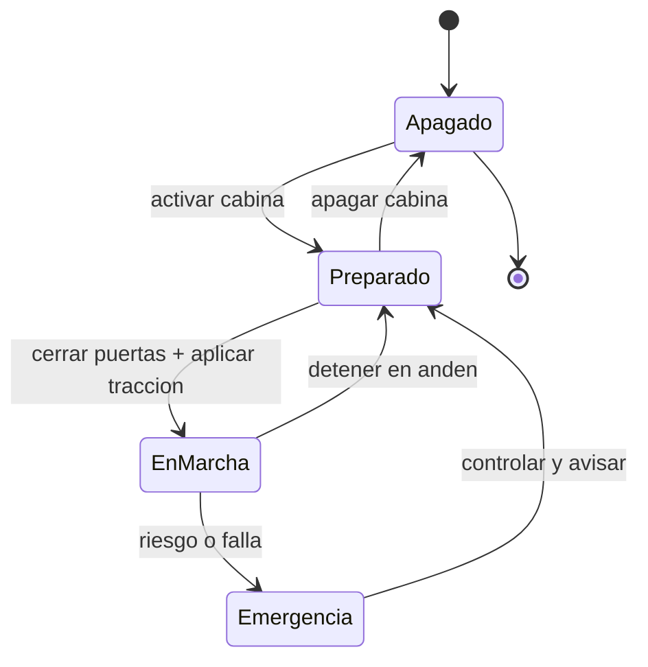

# 🎮 Diseno de simulacion del tren de pasajeros

[🏠 Inicio](../../../README.md) · [🚆 Curso: Tren de pasajeros](../README.md) · 🎮 Simulacion

## Objetivo de la simulacion

Que el usuario aprenda a aplicar traccion de forma progresiva, frenar con
anticipacion combinando freno dinamico y neumatico, respetar la senalizacion y el
ATP, y detener el tren con precision en el anden, de forma segura y progresiva.

## Nivel de realismo

- Nivel elegido: se ofrece del 1 al 3 (ver `docs/03-niveles-de-realismo.md`).
- Justificacion: el tren permite ensenar la gran masa, la adherencia rueda-riel y
  el control por senales, con una complejidad mayor que la moto pero sin la
  direccion libre, porque la via guia la trayectoria.

## Variables principales

| Variable | Tipo | Rango | Afecta a | Comentarios |
| --- | --- | --- | --- | --- |
| Velocidad | numerica | 0-160 km/h | Movimiento y frenado | Central para todo. |
| Traccion aplicada | numerica | 0-100% | Aceleracion | Limitada por adherencia. |
| Freno aplicado | numerica | 0-100% | Deceleracion | Combina dinamico y neumatico. |
| Adherencia | numerica | 0-1 | Traccion y freno | Baja con humedad y hojas. |
| Presion de freno | numerica | 0-10 bar | Freno neumatico | Debe estar en rango para marchar. |
| Masa del tren | numerica | fijo + pasajeros | Inercia y distancia de frenado | Gran masa, frenado largo. |
| Estado de la senal | discreta | via libre, precaucion, parada | Velocidad permitida | Controlado por ATP. |

## Ciclo basico

1. Leer entrada del usuario (traccion, freno, sentido, arenado, puertas).
2. Actualizar estado de la traccion y del sistema de freno.
3. Calcular fuerzas: traccion, frenado, gravedad y adherencia disponible.
4. Aplicar restricciones del entorno (pendiente, humedad, senal, limite ATP).
5. Actualizar velocidad y posicion sobre la via.
6. Refrescar instrumentos y retroalimentacion (velocimetro, ATP, testigos).

## Modos de juego futuros

- Tutorial guiado de mandos de cabina.
- Practica libre en un tramo cerrado.
- Misiones de servicio con paradas y horarios.
- Desafios de frenado de precision en anden.
- Situaciones de baja adherencia controladas (riel humedo) sin contenido sensible.

## Elementos fuera de alcance

- Maniobras que presenten el exceso de velocidad como recomendable.
- Reproduccion de operacion temeraria como objetivo del juego.
- Datos tecnicos que permitan alterar sistemas reales de senalizacion o traccion.

## Pendientes

- [ ] Definir valores por defecto de cada variable por tipo de tren.
- [ ] Prototipar el ciclo basico en un motor simple.
- [ ] Ajustar el modelo de adherencia con riel humedo.
- [ ] Confirmar el ancho de via de la red chilena en la fuente oficial.
- [ ] Agregar fuentes tecnicas publicas a [`manuales/fuentes.md`](../../../manuales/fuentes.md).

---

[⬅️ Anterior: Reglamentos](../reglamentos/reglamentos-tren-pasajeros.md) · [➡️ Siguiente: Recursos](../recursos/recursos-tren-pasajeros.md)
