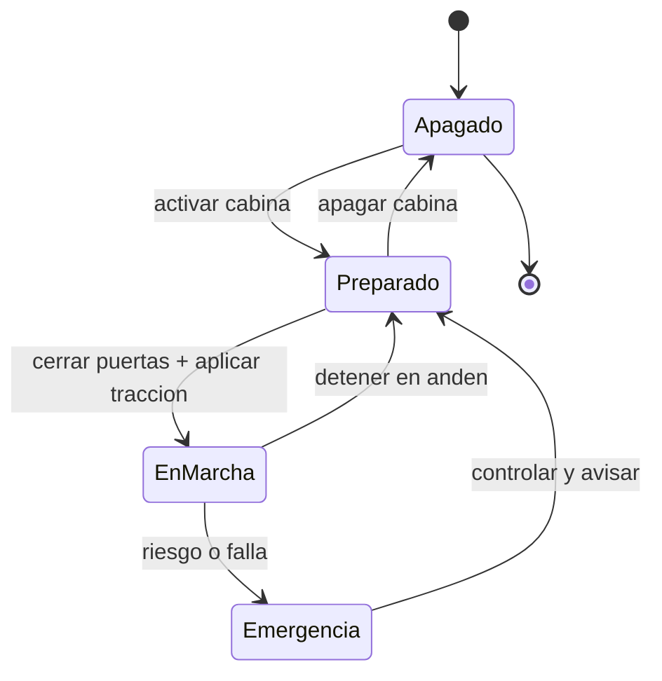

# 🎮 Diseño de simulación del tren de pasajeros

[🏠 Inicio](../../../README.md) · [🚆 Curso: Tren de pasajeros](../README.md) · 🎮 Simulación

## Objetivo de la simulación

Que el usuario aprenda a aplicar tracción de forma progresiva, frenar con
anticipación combinando freno dinámico y neumático, respetar la señalización y el
ATP, y detener el tren con precisión en el andén, de forma segura y progresiva.

## Nivel de realismo

- Nivel elegido: se ofrece del 1 al 3 (ver `docs/03-niveles-de-realismo.md`).
- Justificación: el tren permite enseñar la gran masa, la adherencia rueda-riel y
  el control por señales, con una complejidad mayor que la moto pero sin la
  dirección libre, porque la vía guía la trayectoria.

## Variables principales

| Variable | Tipo | Rango | Afecta a | Comentarios |
| --- | --- | --- | --- | --- |
| Velocidad | numérica | 0-160 km/h | Movimiento y frenado | Central para todo. |
| Tracción aplicada | numérica | 0-100% | Aceleración | Limitada por adherencia. |
| Freno aplicado | numérica | 0-100% | Deceleración | Combina dinámico y neumático. |
| Adherencia | numérica | 0-1 | Tracción y freno | Baja con humedad y hojas. |
| Presión de freno | numérica | 0-10 bar | Freno neumático | Debe estar en rango para marchar. |
| Masa del tren | numérica | fijo + pasajeros | Inercia y distancia de frenado | Gran masa, frenado largo. |
| Estado de la señal | discreta | vía libre, precaución, parada | Velocidad permitida | Controlado por ATP. |

## Ciclo básico

1. Leer entrada del usuario (tracción, freno, sentido, arenado, puertas).
2. Actualizar estado de la tracción y del sistema de freno.
3. Calcular fuerzas: tracción, frenado, gravedad y adherencia disponible.
4. Aplicar restricciones del entorno (pendiente, humedad, señal, límite ATP).
5. Actualizar velocidad y posición sobre la vía.
6. Refrescar instrumentos y retroalimentación (velocímetro, ATP, testigos).

## Modos de juego futuros

- Tutorial guiado de mandos de cabina.
- Práctica libre en un tramo cerrado.
- Misiones de servicio con paradas y horarios.
- Desafíos de frenado de precisión en andén.
- Situaciones de baja adherencia controladas (riel húmedo) sin contenido sensible.

## Elementos fuera de alcance

- Maniobras que presenten el exceso de velocidad como recomendable.
- Reproducción de operación temeraria como objetivo del juego.
- Datos técnicos que permitan alterar sistemas reales de señalización o tracción.

## Pendientes

- [ ] Definir valores por defecto de cada variable por tipo de tren.
- [ ] Prototipar el ciclo básico en un motor simple.
- [ ] Ajustar el modelo de adherencia con riel húmedo.
- [ ] Confirmar el ancho de vía de la red chilena en la fuente oficial.
- [ ] Agregar fuentes técnicas públicas a [`manuales/fuentes.md`](../../../manuales/fuentes.md).

---

[⬅️ Anterior: Reglamentos](../reglamentos/reglamentos-tren-pasajeros.md) · [➡️ Siguiente: Recursos](../recursos/recursos-tren-pasajeros.md)
