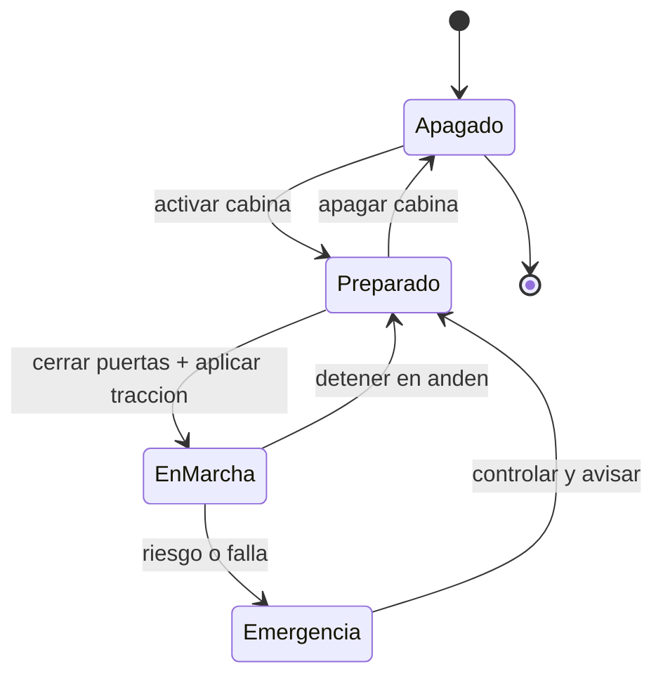
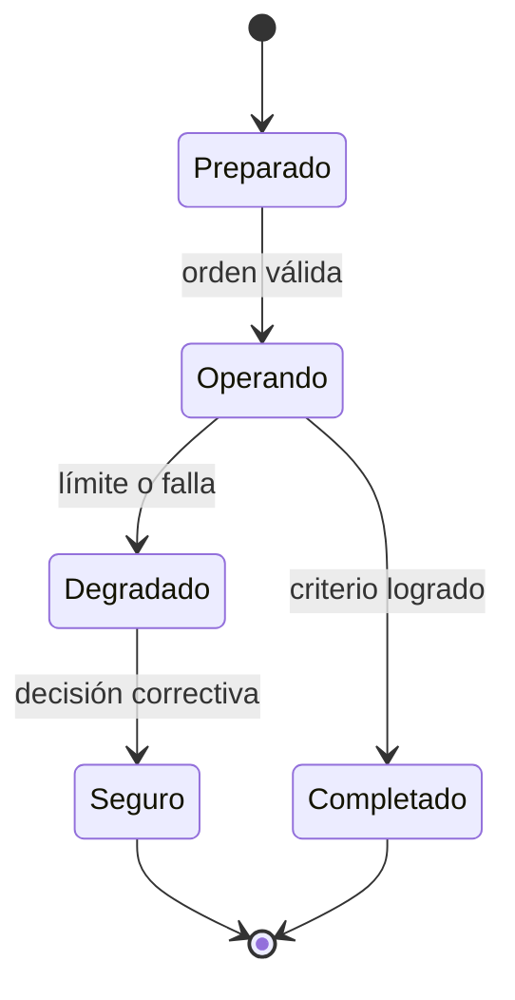

<!-- clase-meta
tipo_documento: clase
clase: 9
codigo: TRENPASAJERO-09
curso: tren-pasajeros
titulo: "Diseño de simulación del tren de pasajeros"
modalidad: "laboratorio de diseño"
duracion_minutos: 90
nivel: introductorio
prerrequisito: TRENPASAJERO-08
competencia: "modelado_de_simulacion"
resultados_aprendizaje:
  - "Explicar objetivo, variables, estados, ciclo y escenarios de simulación con vocabulario propio de Tren de pasajeros."
  - "Aplicar esos conceptos a una decisión segura o a un escenario de simulación de Tren de pasajeros."
evidencia: "Ficha de escenario y diagrama de estados."
criterio_aprobacion: "El modelo es específico de la máquina, medible, seguro y trazable a clases anteriores."
fuentes: manuales/fuentes.md
ultima_revision: 2026-09-10
-->

# 🎮 Diseño de simulación del tren de pasajeros

[🏠 Inicio](../../../README.md) · [🚆 Curso: Tren de pasajeros](../README.md) · 🎮 Simulación

```mermaid
stateDiagram-v2
    [*] --> Apagado
    Apagado --> Preparado: activar cabina
    Preparado --> EnMarcha: cerrar puertas + aplicar traccion
    EnMarcha --> Preparado: detener en anden
    EnMarcha --> Emergencia: riesgo o falla
    Emergencia --> Preparado: controlar y avisar
    Preparado --> Apagado: apagar cabina
    Apagado --> [*]
```

## Objetivo de la simulación

Que el usuario aprenda a aplicar tracción de forma progresiva, frenar con
anticipación combinando freno dinámico y neumático, respetar la señalización y el
ATP, y detener el tren con precisión en el andén, de forma segura y progresiva.

## Nivel de realismo

- Nivel elegido: se ofrece del 1 al 3 (ver `docs/03-niveles-de-realismo.md`).
- Justificación: el tren permite enseñar la gran masa, la adherencia rueda-riel y
  el control por señales, con una complejidad mayor que la moto pero sin la
  dirección libre, porque la vía guía la trayectoria.

## Variables principales

| Variable | Tipo | Rango | Afecta a | Comentarios |
| --- | --- | --- | --- | --- |
| Velocidad | numérica | 0-160 km/h | Movimiento y frenado | Central para todo. |
| Tracción aplicada | numérica | 0-100% | Aceleración | Limitada por adherencia. |
| Freno aplicado | numérica | 0-100% | Deceleración | Combina dinámico y neumático. |
| Adherencia | numérica | 0-1 | Tracción y freno | Baja con humedad y hojas. |
| Presión de freno | numérica | 0-10 bar | Freno neumático | Debe estar en rango para marchar. |
| Masa del tren | numérica | fijo + pasajeros | Inercia y distancia de frenado | Gran masa, frenado largo. |
| Estado de la señal | discreta | vía libre, precaución, parada | Velocidad permitida | Controlado por ATP. |

## Ciclo básico

1. Leer entrada del usuario (tracción, freno, sentido, arenado, puertas).
2. Actualizar estado de la tracción y del sistema de freno.
3. Calcular fuerzas: tracción, frenado, gravedad y adherencia disponible.
4. Aplicar restricciones del entorno (pendiente, humedad, señal, límite ATP).
5. Actualizar velocidad y posición sobre la vía.
6. Refrescar instrumentos y retroalimentación (velocímetro, ATP, testigos).

## Modos de juego futuros

- Tutorial guiado de mandos de cabina.
- Práctica libre en un tramo cerrado.
- Misiones de servicio con paradas y horarios.
- Desafíos de frenado de precisión en andén.
- Situaciones de baja adherencia controladas (riel húmedo) sin contenido sensible.

## Elementos fuera de alcance

- Maniobras que presenten el exceso de velocidad como recomendable.
- Reproducción de operación temeraria como objetivo del juego.
- Datos técnicos que permitan alterar sistemas reales de señalización o tracción.

## Pendientes

- [ ] Definir valores por defecto de cada variable por tipo de tren.
- [ ] Prototipar el ciclo básico en un motor simple.
- [ ] Ajustar el modelo de adherencia con riel húmedo.
- [ ] Confirmar el ancho de vía de la red chilena en la fuente oficial.
- [ ] Agregar fuentes técnicas públicas a [`manuales/fuentes.md`](../../../manuales/fuentes.md).

## 🧭 Guía de estudio aplicada

### Pregunta guía

¿Cómo ayuda **Objetivo de la simulación, Nivel de realismo, Variables principales y Ciclo básico** a **modelar aproximación a estación con lluvia y alta ocupación como estados, variables y decisiones observables**?

### Explicación razonada

Una simulación de Tren de pasajeros es educativa si representa decisiones y consecuencias. Como mínimo debe modelar el estado de captación o motor, la respuesta de convertidor de tracción, la transición en motores de eje y el resultado en rueda-carril. El escenario «aproximación a estación con lluvia y alta ocupación» es valioso porque obliga a observar, formular una hipótesis, actuar y comprobar.

```mermaid
stateDiagram-v2
    [*] --> Preparado
    Preparado --> Operando: orden válida
    Operando --> Degradado: límite o falla
    Degradado --> Seguro: decisión correctiva
    Operando --> Completado: criterio logrado
    Seguro --> [*]
    Completado --> [*]
```

Esta clase se conecta con el resto del curso mediante **adherencia rueda-carril, curva de frenado y cumplimiento de señales**. El hilo de
seguridad consiste en reconocer a tiempo **rebasar el punto de parada o comprometer la comodidad por frenar tarde** y poder justificar la decisión
**anticipar la frenada según señal, pendiente, adherencia y carga**; en clases posteriores cambiará el ángulo de análisis, no esa relación causal.
La lectura funcional común sigue **captación o motor → convertidor de tracción → motores de eje → rueda-carril**, de modo que cada concepto pueda
ubicarse dentro del funcionamiento completo y no quede como un dato aislado.

**Apoyo documental:** [Railroad Operating Practices](https://railroads.fra.dot.gov/railroad-safety/divisions/operating-practices/operating-practices-0) aporta operación, señalización y competencias ferroviarias;
[Human Factors: Tasks and Demands](https://railroads.fra.dot.gov/human-factors/elearning-attention/tasks-demands) se usa para factores humanos y carga de trabajo. Estas fuentes
se contrastan con el alcance de la clase y no sustituyen un manual de equipo concreto.

### Caso resuelto: de la observación a la decisión

1. **Estado inicial:** representa aproximación a estación con lluvia y alta ocupación con valores observables para **captación o motor**, **convertidor de tracción**, **motores de eje** y **rueda-carril**.
2. **Decisión del estudiante:** ofrece una elección que cambie el estado, no una animación automática.
3. **Consecuencia:** modela la tendencia hacia **rebasar el punto de parada o comprometer la comodidad por frenar tarde** y una señal previa que permita corregir.
4. **Cierre:** evalúa la explicación de la decisión, además de si el estudiante “ganó” el escenario.

### Comprueba tu comprensión

1. ¿Qué cuatro estados mínimos necesita el escenario «aproximación a estación con lluvia y alta ocupación»?
2. ¿Qué variable anticipa **rebasar el punto de parada o comprometer la comodidad por frenar tarde** antes de llegar al estado de falla?
3. ¿Cómo evaluarías la explicación del estudiante y no solo el resultado final?

Orientación para revisar tus respuestas

- La primera respuesta debe relacionar el eslabón elegido con un efecto posterior, no solo nombrarlo.
- La segunda debe proponer una señal medible u observable y explicar qué tendencia sería preocupante.
- La tercera debe cambiar al menos una variable de capacidad, mando, entorno o margen de seguridad.

## 🎓 Cierre de clase

- **Actividad:** Diseña un escenario educativo de Tren de pasajeros basado en objetivo, variables, estados, ciclo y escenarios de simulación, con entradas, estados, variables y criterio de cierre.
- **Evidencia:** Ficha de escenario y diagrama de estados.
- **Criterio de aprobación:** El modelo es específico de la máquina, medible, seguro y trazable a clases anteriores.
- **Transferencia:** explica qué cambiaría al pasar a otra variante de esta máquina.

### Fuentes de esta clase

- [US-FRA-OPS](https://railroads.fra.dot.gov/railroad-safety/divisions/operating-practices/operating-practices-0): Railroad Operating Practices, Federal Railroad Administration. Uso: operación, señalización y competencias ferroviarias.
- [US-FRA-HF](https://railroads.fra.dot.gov/human-factors/elearning-attention/tasks-demands): Human Factors: Tasks and Demands, Federal Railroad Administration. Uso: factores humanos y carga de trabajo.

> Las fuentes sostienen el marco conceptual y normativo; esta clase no reemplaza el manual
> del fabricante, la formación certificada ni la habilitación exigida para operar equipos reales.

---

[⬅️ Anterior: Reglamentos](../reglamentos/reglamentos-tren-pasajeros.md) · [➡️ Siguiente: Recursos](../recursos/recursos-tren-pasajeros.md)
